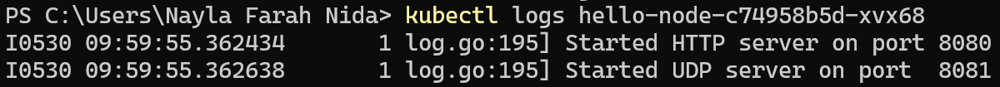
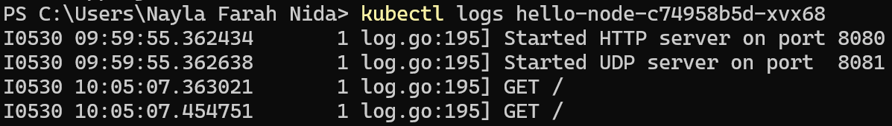
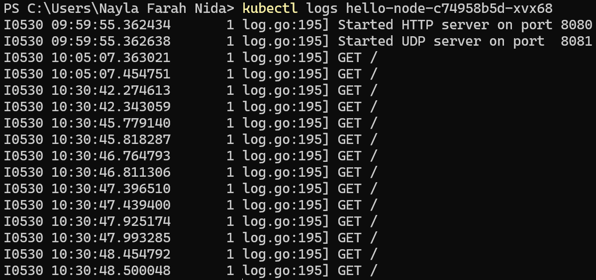
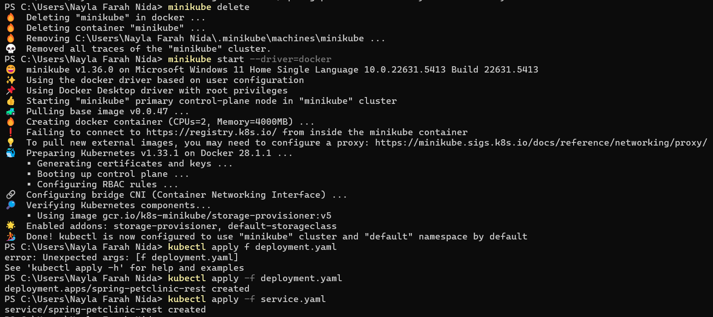
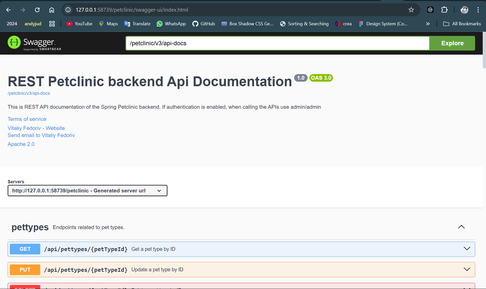

# Tutorial Pemrograman Lanjut
## Nayla Farah Nida - 2306213426

### Module 11

*1. Compare the application logs before and after you exposed it as a Service.*

Sebelum expose:



Log menunjukkan bahwa server HTTP dimulai di port 8080 dan server UDP di port 8081.

Setelah expose:



Log tambahan menunjukkan ada permintaan GET ke server HTTP pada pukul 10:05:07, yang menunjukkan bahwa expose telah membuat aplikasi dapat diakses melalui load balancer pada port 8080. Setelah kubectl expose, aplikasi dapat diakses dari luar cluster, terlihat dari adanya permintaan GET yang tercatat di log.



Jumlah log meningkat setiap kali aplikasi dibuka. Setiap permintaan GET yang dilakukan ke server HTTP tercatat di log, menunjukkan bahwa aplikasi merespons setiap akses yang dilakukan.

*2. What is the purpose of the `-n` option and why did the output not list the pods/services that you explicitly created?*

Opsi ```-n``` pada perintah kubectl get digunakan untuk menentukan namespace tempat sumber daya yang ingin dilihat. Di Kubernetes, namespace memungkinkan pengelompokan sumber daya dalam kelompok terpisah. Ketika tidak menyertakan opsi ```-n```, kubectl secara default akan mencari sumber daya di namespace default. Alasan mengapa pod/service yang dibuat secara eksplisit tidak muncul saat menggunakan ```-n kube-system``` adalah karena pod/service tersebut kemungkinan dibuat di namespace yang berbeda, bukan di namespace kube-system, yang biasanya berisi sumber daya sistem.


### Reflection on Rolling Update & Kubernetes Manifest File

*1. What is the difference between Rolling Update and Recreate deployment strategy?*

```Rolling Update```: Mengupdate pod secara bertahap, mengganti pod lama dengan pod baru satu per satu. Hal ini memastikan aplikasi tetap berjalan tanpa downtime.

```Recreate```: Menghentikan semua pod yang ada terlebih dahulu, kemudian menggantinya dengan pod baru secara bersamaan. Hal ini dapat menyebabkan downtime sementara aplikasi tidak tersedia.

*2. Try deploying the Spring Petclinic REST using Recreate deployment strategy and document your attempt.*



*3. Prepare different manifest files for executing Recreate deployment strategy.*

```strategy.type: Recreate``` pada ```recreate.yml``` menunjukkan bahwa deployment ini akan menggunakan strategi Recreate, yang berarti semua pod yang sedang berjalan akan dihentikan terlebih dahulu sebelum pod baru dijalankan.



*4. What do you think are the benefits of using Kubernetes manifest files? Recall your experience in deploying the app manually and compare it to your experience when deploying the same app by applying the manifest files (i.e., invoking `kubectl apply-f` command) to the cluster.*

Saat melakukan deployment manual, kita perlu mengingat langkah-langkah spesifik untuk membuat pod, layanan, dan komponen lainnya, yang berisiko terjadinya kesalahan. Dengan manifest file, deployment menjadi lebih terstruktur dan dapat diulang. Setelah pertama kali menulis manifest file, kita cukup menjalankan perintah ```kubectl apply -f``` untuk menerapkannya. Hal ini mengurangi risiko kesalahan manual dan memudahkan pengelolaan aplikasi dalam jangka panjang.